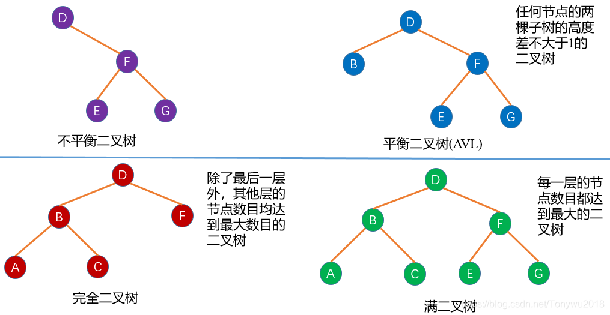

# 数据结构与算法(Algorithms-DataStructures)

- [单链表实现](https://github.com/jiaklop9/Algorithms-DataStructures/blob/master/singleLinkedList.py)

- [单向循环链表实现](https://github.com/jiaklop9/Algorithms-DataStructures/blob/master/singleCircleLinkedList.py)

- [双向链表实现](https://github.com/jiaklop9/Algorithms-DataStructures/blob/master/doubleLinkedList.py)

- [队列实现](https://github.com/jiaklop9/Algorithms-DataStructures/blob/master/queue.py)

- [栈实现](https://github.com/jiaklop9/Algorithms-DataStructures/blob/master/stack.py)

- [冒泡排序实现](https://github.com/jiaklop9/Algorithms-DataStructures/blob/master/bubble_sort.py)
- [插入排序实现](https://github.com/jiaklop9/Algorithms-DataStructures/blob/master/insert_sort.py)
- [归并排序实现](https://github.com/jiaklop9/Algorithms-DataStructures/blob/master/merge_sort.py)
- [快速排序实现](https://github.com/jiaklop9/Algorithms-DataStructures/blob/master/quick_sort.py)
- [选择排序实现](https://github.com/jiaklop9/Algorithms-DataStructures/blob/master/select_sort.py)

- [二分查找实现](https://github.com/jiaklop9/Algorithms-DataStructures/blob/master/binary_search.py)

- [二叉树及遍历实现](https://github.com/jiaklop9/Algorithms-DataStructures/blob/master/binary_tree.py)

## 树

### 树的概念
      有n(n>=1)个有限节点组成的一个具有层次关系的集合。

### 树的特征
      每个节点有0个或多个子节点
      没有父节点的节点称为根节点
      每一个非根节点都有一个父节点
      除根节点外，每个子节点可以分为多个不相交的子树
### 树的专业术语
#### 节点的度：一个节点含有的子树的个数称为节点的度。
#### 节点的层次： 从根节点定义，根节点第一层，根的子节点为第二层，以此类推
#### 树的高度或深度：树中节点的最大层次

### 树的分类
#### 无序树：树中节点没有任何顺序关系，又称自由树
#### 有序树
1. 二叉树：每个节点最多含有两个子树的二叉树，分为左子树，右子树
   1. 完全二叉树：
   2. 满二叉树：除叶节点外，每一个节点都有左右两个子树，并且叶子节点都处在最底层的二叉树(每一层都挂满了节点)
   3. 平衡二叉树: 当且仅当任意节点的两棵子树的高度差不大于1的二叉树。
   4. 排序二叉树(左子树上节点数值大于右子树)
2. 霍夫曼树
3. B树
### 树的存储与表示
#### 顺序存储
    将数据结构存储在固定的数组中，遍历速度上有优势，但是占用大量空间，是非主流二叉树。
#### 链式存储
#### 应用场景
    xml、html等
    路由协议
    mysql数据库索引
    文件系统的目录结构
    一些ai算法其实都是树搜索

### 二叉树特性
1. 在二叉树的第 i 层上汁多有 2^(i-1)个节点(i>0)
2. 深度为 k 的二叉树至多有 2^k - 1 个节点(k > 0)
3. 对任意一个二叉树，如果其叶节点个数为 N0, 度数为 2 的节点总数为 N2, 则 N0 = N2 + 1 
4. 具有 n 个节点的完全二叉树的深度必为 log2(n+1)
5. 对完全二叉树，若从上到下，从左到右编号，则编号为 i 的节点，其左孩子编号必为 2i, 右孩子必为 2i +1, 其双亲编号为 i/2(i=1时除外)
> 完全二叉树：比如有 n 层，第 1 到 n-1 层与满二叉树一样，第 n 层最后一个节点前边挂满了节点
> 